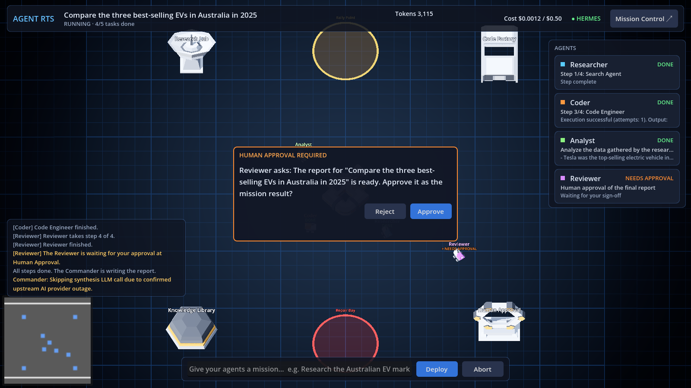
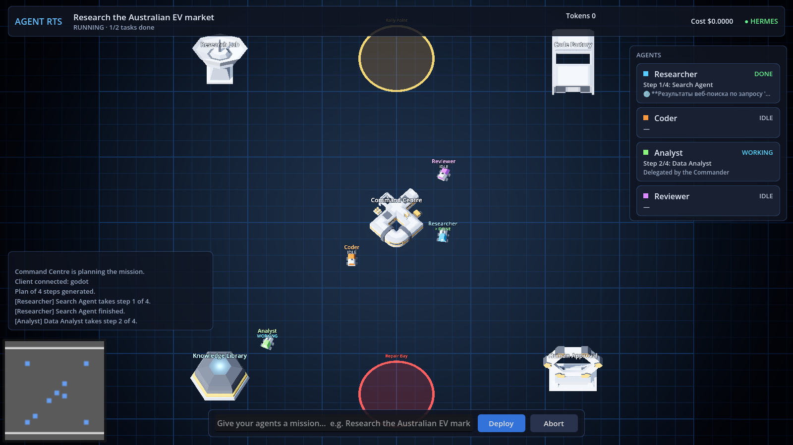
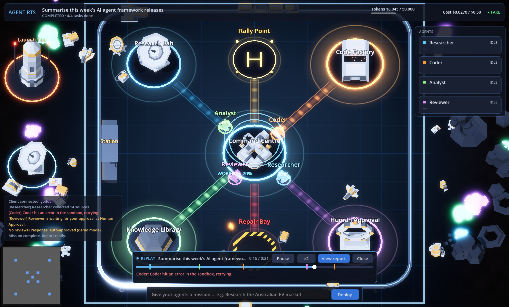
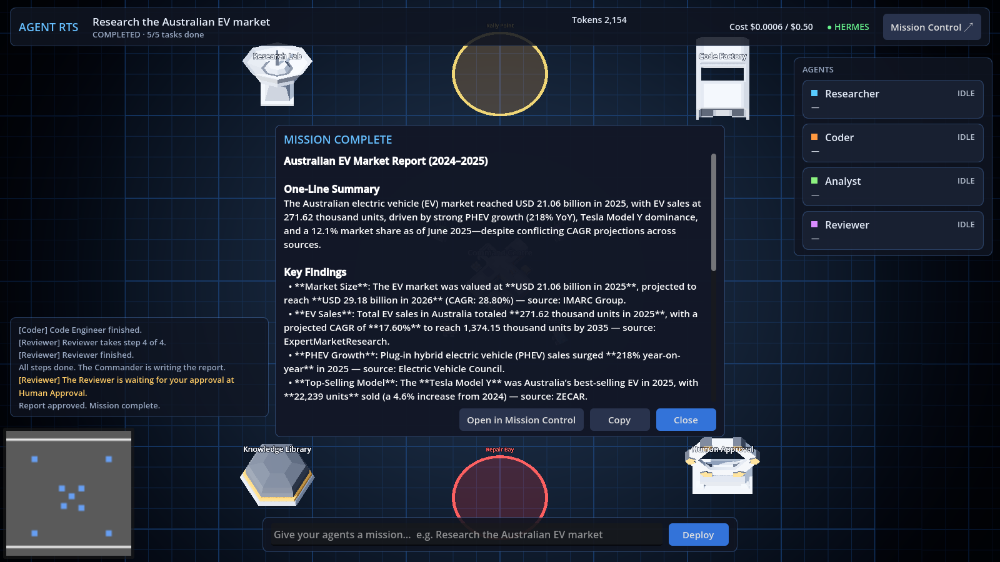

# Agent RTS

**A strategy-game interface for orchestrating AI agents.**

Give a mission and watch a team of seven AI agents carry it out on the map. Every vehicle
is a real Hermes agent, and everything that lights up or moves reflects real work:

| Agent (vehicle) | Real job in Hermes |
|---|---|
| Commander (cargo ship) | the orchestrator: plans, coordinates each step, writes the final synthesis |
| Researcher (rover) | deep research: searches the web and reads sources |
| Scout (speeder) | quick scan of the latest news |
| Analyst (miner) | extracts facts, numbers and trends |
| Coder (speeder) | runs code in the sandbox (calculations, charts) |
| Writer (speeder) | drafts the report from the findings |
| Reviewer (racer) | checks the result, then waits at Human Approval for your sign-off |

The base sits on the Martian sand of the original Open RTS, kept deliberately plain: no
neon, no moving lights. Agents drive along dirt roads to the building that matches their
tool (Research Lab, Code Factory, Knowledge Library), and each building's label says who is
working inside. A failed step sends the agent to the striped Repair Bay, agents blocked on
others wait in the painted Rally Point ring, and Human Approval reads "Waiting for you"
when you're needed. Every mission, step, agent
status and cost is mirrored into Mission Control for the operational view.



The game is the interface; the work is real. It is built from three open-source projects that
stay loosely coupled through one small adapter:

| Layer | Project | Role |
|---|---|---|
| Visual world | [lampe-games/godot-open-rts](https://github.com/lampe-games/godot-open-rts) (MIT), forked into `game/` | The map, units, movement, selection, minimap |
| Agent brain | [pauloberezini/hermes-synapse](https://github.com/pauloberezini/hermes-synapse) (MIT) | An orchestrator that plans and delegates to sub-agents, with web search and a code sandbox |
| Operations | [builderz-labs/mission-control](https://github.com/builderz-labs/mission-control) (MIT) | Tasks, agents, cost tracking, activity feed, approvals |
| Glue | `adapter/` (this repo) | Translates Hermes ⇄ the world contract ⇄ Mission Control |

See [docs/architecture.md](docs/architecture.md) for how it fits together and
[docs/phase0-findings.md](docs/phase0-findings.md) for what we learned about each foundation.

## Quick start (macOS, Apple Silicon)

```bash
scripts/setup.sh      # once: fetch pinned foundations, local model, images, deps (~10 min)
scripts/start.sh      # Hermes + Mission Control + adapter, then opens the game
```

Type a mission into the command bar (e.g. *Research the Australian EV market*) and press
**Deploy**. When the Reviewer walks to Human Approval, click **Approve** (or click the Human
Approval building). When the mission ends, a short replay plays (holographic agents re-run
the mission at high speed) and then the report opens. Click **View report** to skip
ahead, or **▶ Replay** in the report to watch it again.

- **Mission Control:** http://127.0.0.1:3000. The login is in `.env` (`MC_ADMIN_USER` / `MC_ADMIN_PASS`).
  Pending approvals appear as tasks in *review*; approving one there approves it in the game.
- **Demo mode without any LLM:** `scripts/start.sh --fake` plays scripted missions that use every
  agent state.
- **Stop:** `scripts/stop.sh`.

Prerequisites: Docker (Colima with 6 GB is enough), Node 23.6+ (the adapter runs TypeScript
natively), pnpm, Godot 4.4+ (`brew install --cask godot`) and Ollama.

### The screen

The base is seen diagonally, framed by scenery that suits the terrain (forest and a lake on
Grassland, cacti in the Sahara, rocks and craters on the planets). It is walled, with gates
where the paved streets leave and towers at the corners; each district flies a banner in its
department's colour and holds props that suit it (cargo and trucks in Engineering, solar
arrays and dishes in Research, parked ships in the Commons). Props are placed clear of
buildings and their doors, and are laid out the same way every time for the same base. Everything on screen comes
from the live world state:

- **Top bar:** tabs (Mission, Departments, Build, Settings), tokens and cost against the
  budget, connection, and a clock.
- **Mission tab (left):** type a mission and press Deploy; the running mission with its
  progress, recent finished missions (click one to reopen its report), the mission's task
  checklist as the Commander creates and finishes tasks, and an activity feed.
- **Agents (right):** a card per character with a portrait rendered from its own model, its
  state, current task and progress, grouped by department.
- **Selected agent (bottom centre):** click a card or a character: portrait, department, state,
  task, progress, job, and Focus / Home / Edit.
- **Selected building (bottom right):** click a building: what its department does, who is
  working there right now (with progress), who lives there; Human Approval requests can be
  approved or rejected right there.
- **Map:** buildings carry name plates with their department icon; characters have a ring in
  their colour at their feet and walk, work, wave for approval and shake their head after an
  error; a dashed line in the agent's colour shows where a moving agent is going.
- **Minimap (bottom left):** with buttons to show the whole base and zoom in or out.

### Build mode

Click **Build** (top right) to design your own base. Everything you build does real work.

The base is organised into five **departments**, each with a colour and a district on the map
(a 3×3 grid of blocks split by streets, with the department's name painted on the ground):

```
Research   | Commons (Rally Point) | Engineering
Research   | Command + Approval    | Engineering
Knowledge  | Knowledge             | Commons (Repair Bay)
```

| Department | Work | Who lives there by default |
| --- | --- | --- |
| Command | Plans missions; you approve risky steps at Human Approval | Commander |
| Research | Web search, news and sources | Researcher, Scout |
| Engineering | Code, data and calculations | Coder |
| Knowledge | Notes, analysis and writing | Analyst, Writer, Reviewer |
| Commons | Shared spaces: meetings, waiting (Rally Point), repairs (Repair Bay) | none |

A building belongs to the department of the work it hosts and takes its colour; a character
belongs to its home building's department. The **Departments** panel (top left) shows each
department's size, and clicking one moves the camera there. The agent list (right) is grouped
the same way.

- **Buildings:** add one with a name, a department and a model (models that suit the
  department are offered first). **Add to district** puts it in the next free slot of its
  district; **Choose spot** lets you click a place yourself. **Organise base** moves every
  building back into its district. A tool call sends a character to a building of the matching
  department, preferring its own home. Any building, the Rally Point and the Repair Bay can be
  moved; your own buildings can be removed (the Command Centre and Human Approval are
  permanent). The map is 44×44; district slots are 7 units apart, so every building has room
  in front for its characters, who park at its door. The base holds up to 32 buildings (the
  districts' slots); a spot you choose yourself must be at least 4.5 units from others. Models: KayKit Space Base Bits (domes, depots, drills,
  landers, landing pads, turbines), Quaternius buildings (geodesic dome, houses, base), every
  standalone building in the Kenney Space Kit, Open RTS's own Vehicle Factory, Aircraft
  Factory and turrets, and a Rocket assembled from the kit's rocket parts.
- **Characters:** create one with a name, a job description, a skill (web research or thinking
  only), a model (animated astronauts, mechs and aliens that walk, or vehicles), a colour and a
  home building (which decides its department). Up to 24
  custom characters on top of the 7 built-in ones. Each character is created as a real Hermes
  sub-agent under the Commander, so the next mission can delegate to it. Built-in characters
  can be renamed and restyled; your own can be removed. Vehicles include Open RTS's Tank and
  a Monorail Train, both assembled from kit parts.
- **Terrain:** pick the ground and light: on Earth (Grassland, Sahara Desert, Arctic Ice,
  Tropical Beach, Grand Canyon) or other worlds (Mars, the Moon, Venus, Europa, Titan). It's
  only looks, so it can change at any time. Each terrain is a 1024² PBR texture set
  (colour, normal, roughness) built from a **Poly Haven** photo scan (CC0), plus a large-scale
  macro layer. Earth terrains use the scans as they are; other worlds colour-grade one and
  blend in generated features (lunar craters, Europa's lineae). To rebuild:
  `python3 tools/bake_terrains.py && python3 tools/import_polyhaven.py` (numpy, scipy,
  Pillow; scans are cached in `.data/polyhaven/`). Each set's `SOURCE.txt` names its scan.
- **Reset base** (press twice) restores the default layout.

The base is saved by the adapter in `.data/base.json`, so it survives restarts. Edits are
blocked while a mission is running.

### Settings

**Settings** (top right) changes display mode (window or fullscreen), window resolution
(1280×720 up to 3840×2160 / 4K), 3D render resolution (50–100%, lower is faster on 4K/5K
screens), anti-aliasing, menu text size (70–120%), map label size (names above characters and buildings, 30–80%), and map zoom. Changes apply immediately and are saved for next time
(`~/Library/Application Support/Godot/app_userdata/Agent RTS/agent_rts_settings.cfg`).

### Controls

| | |
|---|---|
| Pan | WASD or screen edges |
| Zoom | Mouse wheel |
| Select an agent | Click it, or click its card in the roster (centres the camera) |
| Select a building | Click it (details bottom right) |
| Show the whole base | The frame button by the minimap (or Fit map in Settings) |
| Approve | The dialog, or click the Human Approval building |
| Abort a mission | **Abort** next to Deploy |

| Agents at work | Mission replay (ghost agents + timeline) | Mission complete, with a sourced report |
|---|---|---|
|  |  |  |

## Models

The default is fully local and free: `agentrts-qwen3` (Qwen3 4B instruct with a 16K context)
on Ollama. A mission takes 2–5 minutes on an M1 Pro. Small local models give rough reports, and
Hermes skips its final synthesis when a model call times out (45 s per call). For better
results, point Hermes at any OpenAI-compatible endpoint in `infra/hermes.env`:

```bash
LLM_API_BASE=https://openrouter.ai/api/v1
OPENROUTER_API_KEY=sk-or-...
LLM_MODEL=anthropic/claude-haiku-4.5   # and the AGENT_MODEL_* / LLM_FALLBACK_MODEL lines
```

Then run `scripts/stop.sh && scripts/start.sh`. Set `ADAPTER_COST_BUDGET_USD` in `.env` to
change the budget shown in the HUD. Hermes itself does not enforce budgets.

## Repository layout

```
adapter/            world contract, Hermes source, Mission Control sink, fake source, tests
game/               Godot project (Open RTS fork); new code in game/source/agent/
infra/              Hermes compose override, Hermes plugin, Ollama Modelfile, SearXNG, pins
scripts/            setup / start / stop / run-mission / gen-env
docs/               architecture and phase 0 findings
vendor/             Hermes Synapse + Mission Control (+ Open RTS upstream), gitignored, pinned
```

## Development

```bash
cd adapter && npm test                         # contract, fake source, Hermes translator (real captured frames), MC sink
cd adapter && npm run demo                     # adapter alone with looping scripted missions
godot --path game                              # the game (connects to ws://127.0.0.1:8770/world)
scripts/run-mission.sh "Your mission" --approve   # drive a mission headless and print agent states
```

Visual checks: `godot --path game -- --capture-dir=/tmp/shots --capture-at=5,20 --quit-after-capture`
saves screenshots at those seconds.

## Known limitations

- **Cancelling a mission only cancels it in the game.** Hermes has no cancel API, so the current
  step keeps running server-side, and its activity can briefly overlap the next mission's.
- Token counts are estimates (Hermes counts characters ÷ 4). Costs come from Hermes' price table.
- Hermes' auth uses its built-in local dev token. Keep its port bound to localhost, as configured.
- Mission Control also lists any local Claude Code or Codex agents it discovers on this machine.
- macOS only so far (start and setup scripts). The Godot project itself is cross-platform.

## Licences

Agent RTS code is MIT. The game is a fork of Open RTS (MIT, Pawel Lampe) with Kenney's Space
Kit (CC0); see `game/LICENSE` and `game/LOGO_LICENSES.md`. Also CC0: [KayKit Space Base
Bits](https://github.com/KayKit-Game-Assets/KayKit-Space-Base-Bits-1.0) by Kay Lousberg and
the [Ultimate Space Kit](https://quaternius.com/packs/ultimatespacekit.html) by Quaternius
(`game/assets/models/*/LICENSE.txt`). Terrain photo scans are from
[Poly Haven](https://polyhaven.com) (CC0): aerial_grass_rock, aerial_sand, snow_field_aerial,
aerial_beach_01, worn_rock_natural_01, red_laterite_soil_stones, moon_01, mud_cracked_dry_03
and snow_01. Hermes Synapse and Mission Control
are MIT and are fetched unmodified into `vendor/`.
