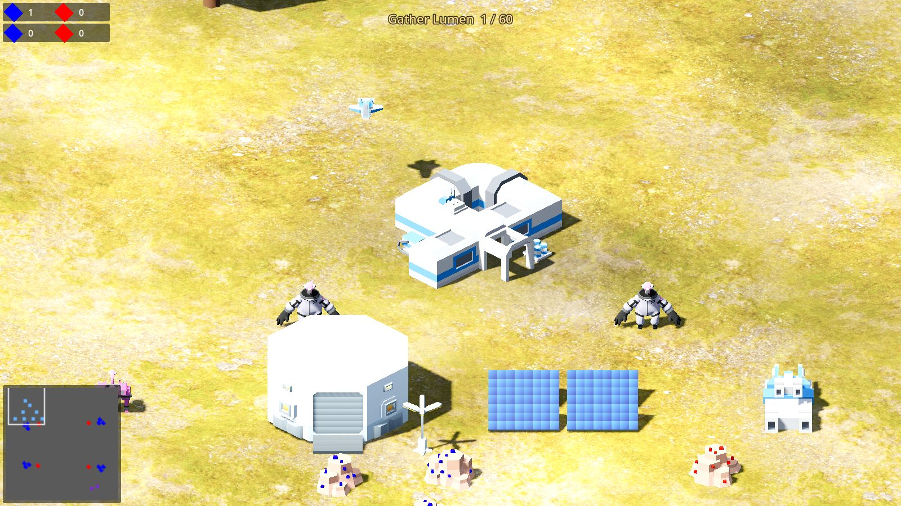
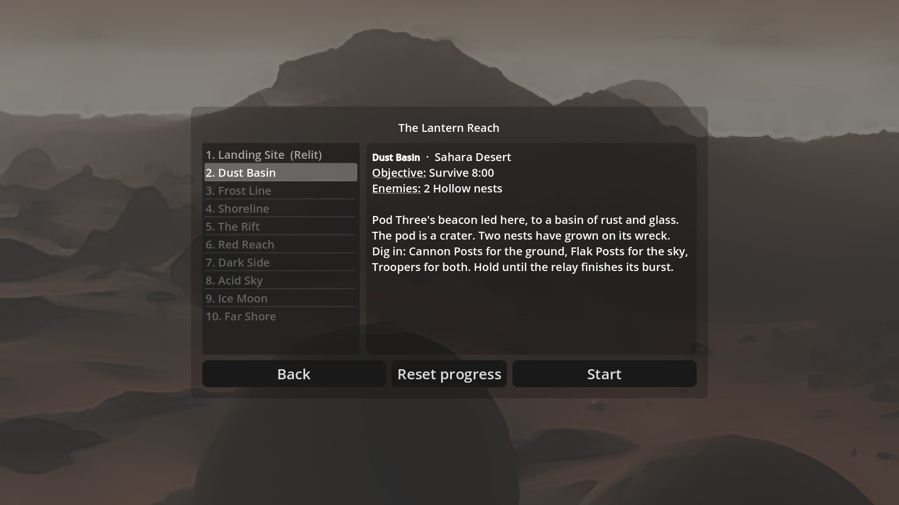
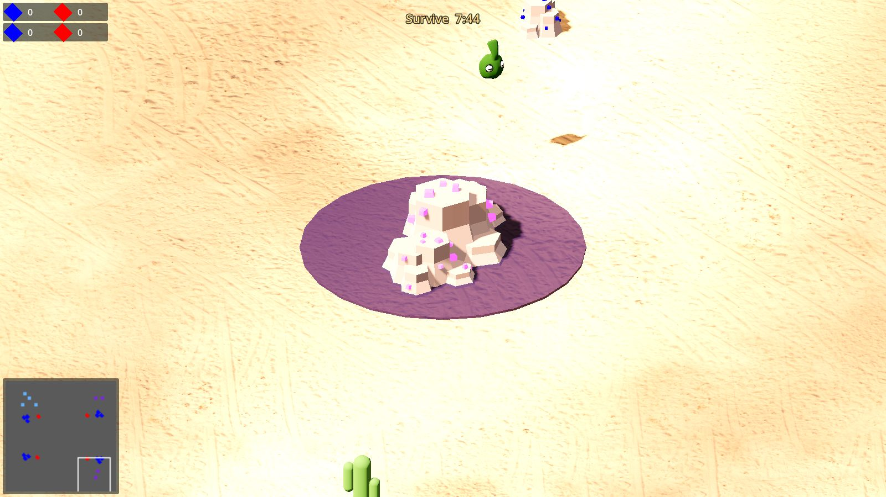
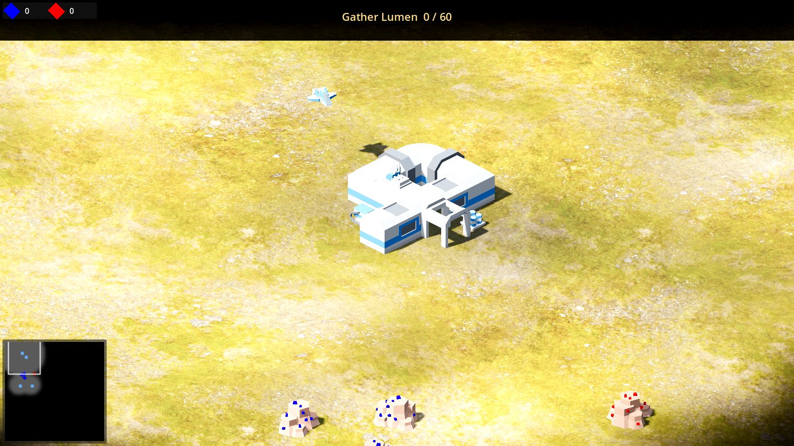

# Lantern Reach

**A single-player real-time strategy game. Ten worlds, one light.**

The generation ship *Lantern* broke apart on the edge of the Reach, and its landing pods fell
across ten worlds. You command Pod Seven. Mine crystal, build a base around your Lantern
Core, and relight the Reach world by world: against the **Hollow**, a swarm that nests in the
crystal and hunts at night, and against the **Wardens**, the crew of Pod One who believe every
light you make calls the Hollow down on all of them.

Lantern Reach is a standalone Godot 4 game. It is built on
[Open RTS](https://github.com/lampe-games/godot-open-rts) (MIT, Pawel Lampe) and CC0 art from
Kenney, KayKit, Quaternius and Poly Haven. There is no AI agent, no server and no network: the
whole game is the `lantern-reach/` Godot project.



| The campaign | A Hollow nest | Fog of war |
|---|---|---|
|  |  |  |

A full roster with stats, the controls and an opening build are in
[docs/how-to-play.md](docs/how-to-play.md).

## Play

Prerequisites: [Godot 4.3+](https://godotengine.org/download) (standard build, no .NET needed).

```bash
godot --path lantern-reach            # run the game
godot --path lantern-reach -e         # open it in the editor
```

Or run a build: `godot --headless --path lantern-reach --export-release "Linux/X11" build/lantern-reach.x86_64`
(also `"Windows Desktop"` and `"macOS"`) with the matching export templates installed.

- **Campaign:** the ten worlds in order. Each has a briefing, a terrain and an objective.
  Winning one unlocks the next; progress is saved in Godot's user folder.
- **Skirmish:** pick a map, a world (terrain), the players (you, Wardens AI) and a number
  of Hollow nests.
- **Controls:** left-drag selects, right-click moves or attacks, `WASD` scrolls, `Q`/`E`
  rotates the map, `R` rotates a structure being placed, `Esc` opens the menu,
  `Ctrl+1..9` sets unit groups.

## The game in one table

| | Pod Seven (you) | The Wardens | The Hollow |
|---|---|---|---|
| Plays like | base building: mine, build, train | the Open RTS AI with your roster | nests that send waves |
| Units | Engineer, Scout Drone, Trooper, Tank, Gunship | same | Mote, Brute, Wasp |
| Structures | Lantern Core, Mech Forge, Vehicle Bay, Hangar, Solar Array, Cannon Post, Flak Post | same | Nest |
| Beaten by | losing every unit | losing every unit | burning out every nest, then every creature |

Lumen (blue crystal) builds, Ember (red crystal) fights. A day lasts eight minutes; at night
sight drops, waves grow and solar income stops. Every number is in
[docs/design.md](docs/design.md), with the story, the ten worlds and what is planned next.

## Repository

```
lantern-reach/      the Godot project (game code, assets, tests)
docs/design.md      story, rules and systems
tools/              terrain texture bake and Poly Haven import (Python)
```

A headless smoke test runs a world without a screen and reports script errors:

```bash
godot --headless --path lantern-reach res://tests/smoke/Smoke.tscn -- --world=basin --frames=300
```

## Licences

Lantern Reach's own code and art are MIT (see `LICENSE`). The game is built on Open RTS
(MIT, Lampe Games; `lantern-reach/LICENSE`). Art: Kenney Space Kit (CC0),
[KayKit Space Base Bits](https://github.com/KayKit-Game-Assets/KayKit-Space-Base-Bits-1.0) by
Kay Lousberg (CC0), the [Ultimate Space Kit](https://quaternius.com/packs/ultimatespacekit.html)
by Quaternius (CC0), and terrain photo scans from [Poly Haven](https://polyhaven.com) (CC0).
Logo licences are in `lantern-reach/assets/logos/LOGO_LICENSES.md`.
