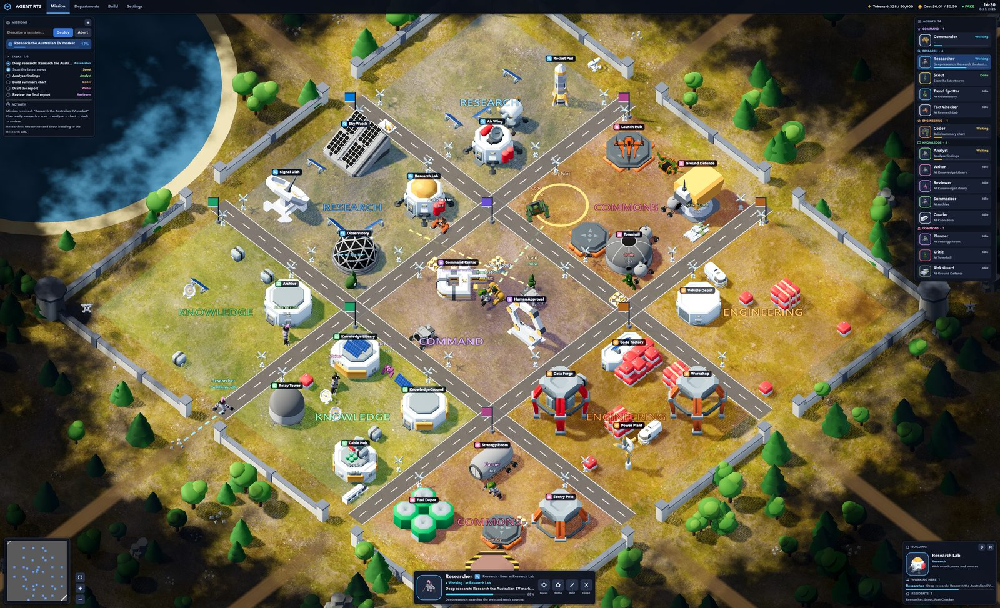
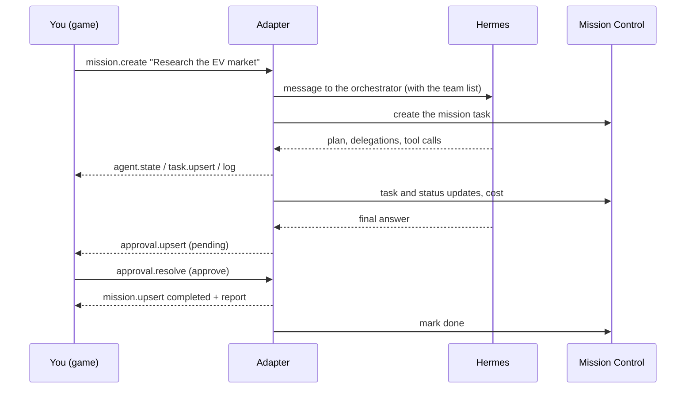
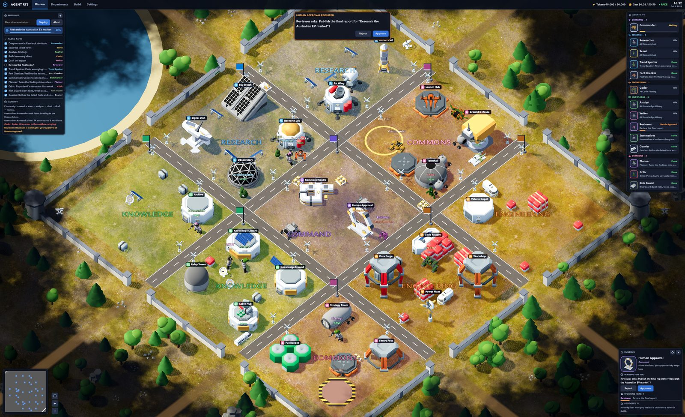
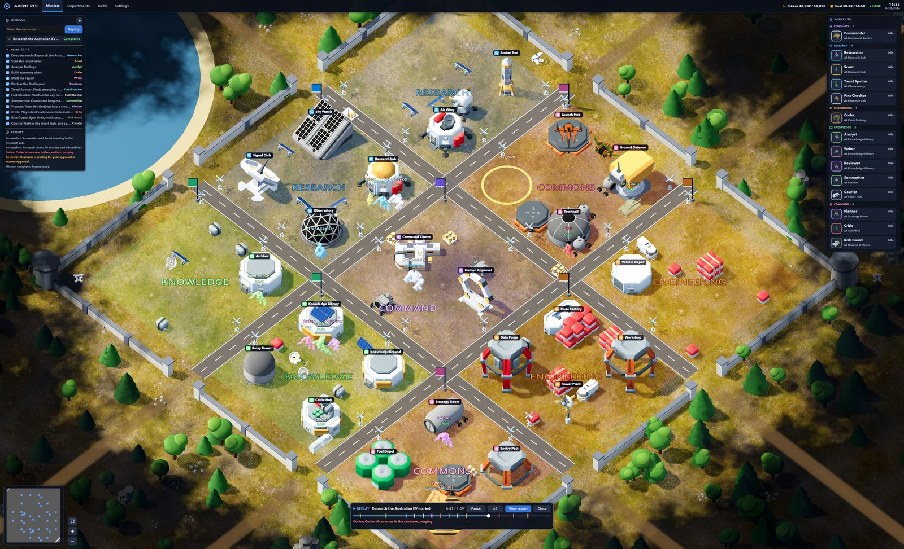
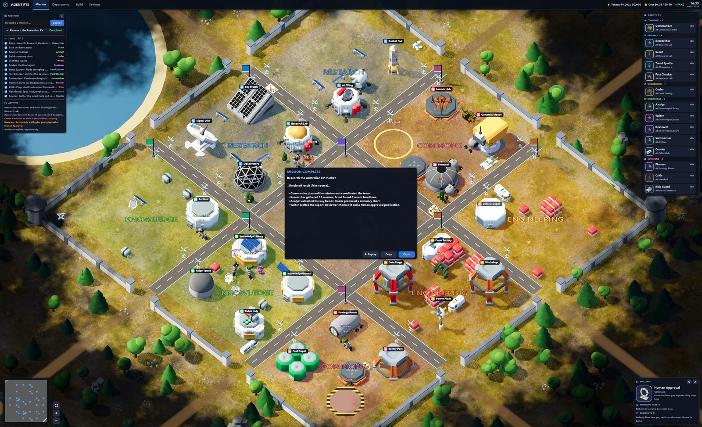
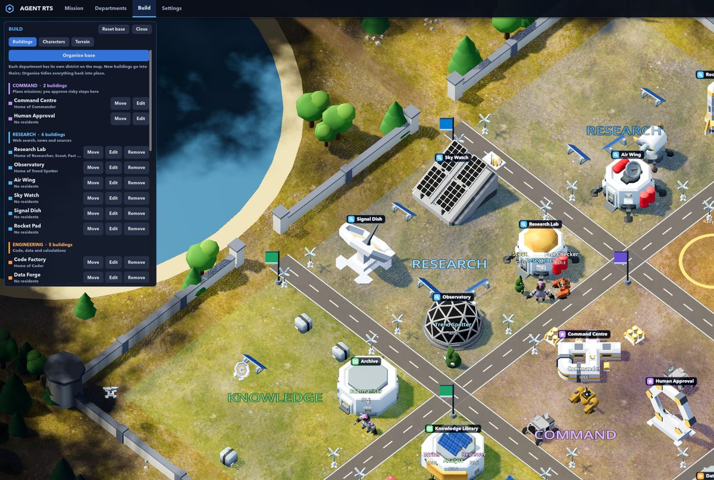
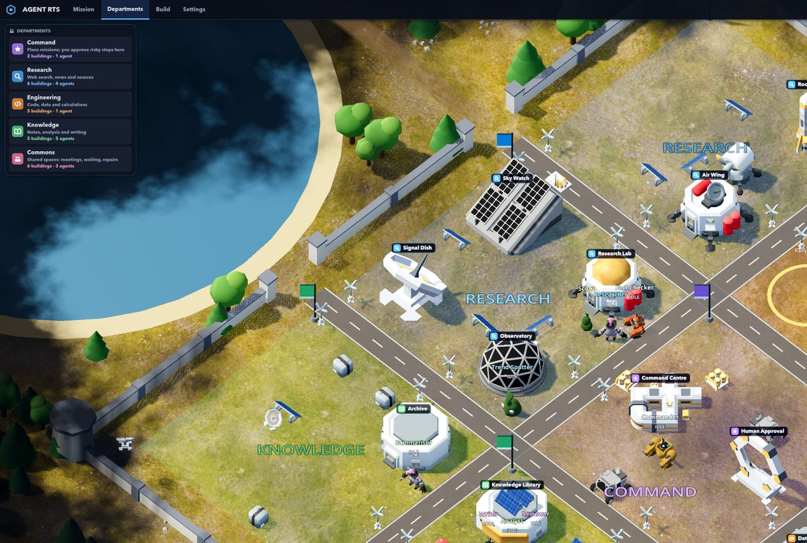
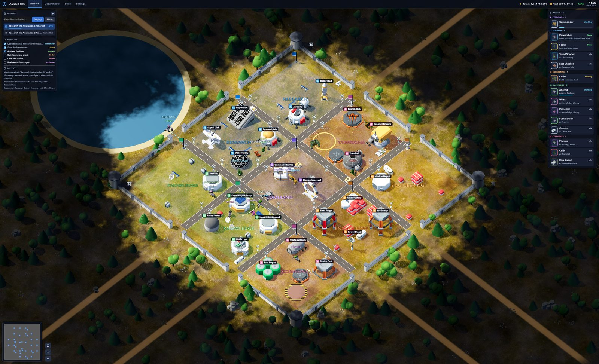

# Agent RTS

**An AI agent team you watch like a real-time strategy game.**

Give a mission and watch a team of AI agents carry it out on a walled base. Every character
on the map is a real agent in [Hermes Synapse](https://github.com/pauloberezini/hermes-synapse):
when it searches the web it leaves the base to explore, when it writes it works in the
Knowledge district, and when a report needs your sign-off it waits at Human Approval. Every
mission, step, agent status and cost is mirrored into
[Mission Control](https://github.com/builderz-labs/mission-control) for the operational view.



| Character | Real job in Hermes | Home |
|---|---|---|
| Commander (mech) | the orchestrator: plans the mission, delegates each step, writes the final summary | Command Centre |
| Researcher (astronaut) | deep research: searches the web and reads sources | Research Lab |
| Scout (alien flyer) | quick scan of the latest news | Research Lab |
| Analyst (astronaut) | extracts facts, numbers and trends | Knowledge Library |
| Coder (mech) | runs code in the isolated sandbox container (calculations, charts) | Code Factory |
| Writer (astronaut) | drafts the report from the findings | Knowledge Library |
| Reviewer (mech) | checks the result, then waits at Human Approval for your sign-off | Knowledge Library |

You can add up to 24 more characters of your own in Build mode; each becomes a real Hermes
sub-agent that the Commander can delegate to.

## How it fits together

Agent RTS joins three open-source projects with one small piece of glue. Each part has one
job, and they talk only through the adapter.

| Part | Project | Runs on | Job |
|---|---|---|---|
| Game | [lampe-games/godot-open-rts](https://github.com/lampe-games/godot-open-rts) (MIT), forked into `game/` | Godot 4.7 | Draws everything: base, characters, HUD, terrain, scenery, shroud. Does no AI work itself. |
| Agent brain | [pauloberezini/hermes-synapse](https://github.com/pauloberezini/hermes-synapse) (MIT) | `127.0.0.1:8100`, Docker | An orchestrator plans each mission and delegates steps to sub-agents with web search and a code sandbox. |
| Operations | [builderz-labs/mission-control](https://github.com/builderz-labs/mission-control) (MIT) | `127.0.0.1:3000` | Task board, agents, activity, tokens and cost. Mirrors missions; doesn't start them. |
| Glue | `adapter/` (this repo) | `127.0.0.1:8770`, Node | Turns Hermes traces into world events for the game, mirrors them to Mission Control, owns the base layout and the Human Approval checkpoint. |

The model is local and free by default: Ollama runs `agentrts-qwen3` (Qwen3 4B instruct,
16K context). See [Models](#models) for using a hosted model instead.



- **Planning.** The Commander thinks at the Command Centre while Hermes plans.
- **Steps.** Each delegation becomes a task. The agent walks to a building of the department
  that matches the tool it uses, preferring its own home. Web research sends it outside the
  walls on an expedition.
- **Waiting and errors.** Agents waiting on others gather at the Rally Point; a failed step
  sends its agent to the Repair Bay.
- **Approval.** Hermes never asks a human, so the adapter adds the checkpoint: the Reviewer
  waits at Human Approval until you approve or reject.
- **Report.** A short replay of the mission plays first, then the report opens. Finished
  missions stay in the Missions list and in Mission Control.

More detail in [docs/architecture.md](docs/architecture.md), including the full event and
command contract.

## Quick start (macOS, Apple Silicon)

```bash
scripts/setup.sh      # once: fetch pinned foundations, local model, images, deps (~10 min)
scripts/start.sh      # Hermes + Mission Control + adapter, then opens the game
```

Type a mission into the Missions panel (e.g. *Research the Australian EV market*) and press
**Deploy**. When the Reviewer reaches Human Approval, click **Approve** in the dialog or in
the Human Approval building's panel. When the mission ends, the replay plays and then the
report opens.

- **Mission Control:** http://127.0.0.1:3000. The login is in `.env` (`MC_ADMIN_USER` /
  `MC_ADMIN_PASS`). Pending approvals appear as tasks in *review*; approving one there
  approves it in the game.
- **Demo mode without any LLM:** `scripts/start.sh --fake` plays scripted missions that use
  every agent state.
- **Stop:** `scripts/stop.sh`.

Prerequisites: Docker (Colima with 6 GB is enough), Node 23.6+ (the adapter runs TypeScript
natively), pnpm, Godot 4.4+ (`brew install --cask godot`) and Ollama.

| Human Approval | Mission replay | Mission report |
|---|---|---|
|  |  |  |

## The base

Everything is organised by **department**. A building belongs to the department of the work
it hosts and takes its colour; a character belongs to its home building's department.

```
Research   | Commons (Rally Point) | Engineering
Research   | Command + Approval    | Engineering
Knowledge  | Knowledge             | Commons (Repair Bay)
```

| Department | Work | Tools that send agents there | Built-in residents |
|---|---|---|---|
| Command | Plans missions; Human Approval | — | Commander |
| Research | Web search, news, sources | search, browse, fetch, news, rss | Researcher, Scout |
| Engineering | Code, data, calculations | execute, python, sandbox, shell | Coder |
| Knowledge | Notes, analysis, writing | memory, rag, document, note | Analyst, Writer, Reviewer |
| Commons | Meetings, waiting, repairs | — | — |

The map is 44 × 44 units, split by paved streets into a 3 × 3 grid of districts. Each
district has 2 × 2 building slots 7 units apart, so every building has room in front for its
characters, who wait at its door. The base holds up to 32 buildings.

### Build mode

Open the **Build** tab to design your own base. Everything you build does real work.

| Build mode | Departments |
|---|---|
|  |  |

- **Buildings:** add one with a name, a department and a model (models that suit the
  department are offered first). **Add to district** puts it in the next free slot of its
  district; **Choose spot** lets you click a place yourself. **Organise base** moves every
  building back into its district. Buildings, the Rally Point and the Repair Bay can be moved;
  your own buildings can be removed (the Command Centre and Human Approval are permanent).
- **Characters:** create one with a name, a job description, a skill (web research or
  thinking only), a model, a colour and a home building (which decides its department). Up to
  24 custom characters on top of the 7 built-in ones; each is created as a real Hermes
  sub-agent `rts_<id>` under the Commander, so the next mission can delegate to it. Built-in
  characters can be renamed and restyled; your own can be removed.
- **Terrain:** five on Earth (Grassland, Sahara Desert, Arctic Ice, Tropical Beach, Grand
  Canyon) and five on other worlds (Mars, the Moon, Venus, Europa, Titan). Terrain is only
  looks, so it can change at any time, even mid-mission.
- **Reset base** (press twice) restores the default layout.

Models come from KayKit Space Base Bits and the Quaternius Ultimate Space Kit (both CC0), the
Kenney Space Kit, Open RTS's own factories and turrets, and a few assembled ones (Rocket, Tank,
Monorail Train). The Quaternius astronauts, mechs and aliens are animated: they walk or run,
work at buildings, wave when they need approval and shake their head after an error.

The base is saved by the adapter in `.data/base.json`, so it survives restarts. Structural
edits are blocked while a mission is running.

## The screen

Everything on screen comes from the live world state.

| Area | What it shows |
|---|---|
| Top bar | Tabs (Mission, Departments, Build, Settings), tokens and cost against the budget, connection, Mission Control link, clock |
| Mission tab | New mission box; the running mission with progress; recent finished missions (click one to reopen its report); the task checklist; activity feed |
| Agents (right) | A card per character with a portrait rendered from its own model, its state, task and progress, grouped by department |
| Selected agent (bottom centre) | Portrait, department, state, task, progress, job; Focus, Home, Edit |
| Selected building (bottom right) | What its department does, who is working there now, who lives there; Human Approval requests can be decided here |
| Map | Name plates with department icons, a ring in each character's colour at its feet, dashed route lines showing where moving agents are going |
| Minimap (bottom left) | With buttons to show the whole base and zoom in or out |

### World and exploration



- **View.** A diagonal camera (45° round, 50° down) with ambient occlusion and a soft sun.
  Each terrain is a 1024² photo-scan texture set built from [Poly Haven](https://polyhaven.com)
  scans (CC0).
- **Base dressing.** A perimeter wall with gates and corner towers, paved streets with lamps,
  a banner in each district's colour, and props per department (cargo and trucks, solar
  arrays, dishes, parked ships), placed clear of buildings and doors.
- **Scenery.** Forests and a lake on Grassland, a sea on the Beach, cacti in the Sahara, mesas
  in the Canyon, rocks, craters and crystals on the planets, alien trees on Venus and Titan.
- **Shroud.** Land beyond the explored area lies under a dark, unexplored shroud whose soft
  edge swallows the base's corners first. Pan out there, or zoom out to 72.
- **Exploration.** Web research is an expedition: the agent walks out through the nearest
  gate to a site in the wild (a new site for each task), works there and walks back. The land
  it passes is uncovered for good and saved in
  `~/Library/Application Support/Godot/app_userdata/Agent RTS/agent_rts_explored.png`
  (delete it to cover the world again).

### Settings and controls

**Settings** changes window or fullscreen, window size (up to 3840 × 2160), 3D render
resolution (lower is faster on 4K/5K screens), anti-aliasing, menu text size, map label size
and zoom. They are saved in
`~/Library/Application Support/Godot/app_userdata/Agent RTS/agent_rts_settings.cfg`.

| | |
|---|---|
| Pan | WASD or screen edges |
| Zoom | Mouse wheel, or the + / − buttons by the minimap |
| Select an agent | Click it, or click its card (centres the camera) |
| Select a building | Click it (details bottom right) |
| Show the whole base | The frame button by the minimap |
| Approve | The dialog, or the Human Approval building's panel |
| Abort a mission | **Abort** next to Deploy |

## Models

The default is fully local and free: `agentrts-qwen3` on Ollama. A mission takes 2–5 minutes
on an M1 Pro. Small local models give rough reports, and Hermes skips its final synthesis when
a model call times out (45 s per call). For better results, point Hermes at any
OpenAI-compatible endpoint in `infra/hermes.env` (created from `infra/hermes.env.example` on
first start; it is git-ignored, so keys stay local):

```bash
LLM_API_BASE=https://openrouter.ai/api/v1
OPENROUTER_API_KEY=sk-or-...
LLM_MODEL=anthropic/claude-haiku-4.5   # and the AGENT_MODEL_* / LLM_FALLBACK_MODEL lines
```

Then run `scripts/stop.sh && scripts/start.sh`. Set `ADAPTER_COST_BUDGET_USD` in `.env` to
change the budget shown in the HUD.

## Security

Everything listens on 127.0.0.1 only. The adapter accepts requests from local tools alone:
anything carrying a browser `Origin` header or a non-loopback `Host` is refused, and
`POST /command` must be `application/json`, so a web page open in your browser can't start
missions, approve them or read reports. Hermes' shell tool is redirected by the Agent RTS
plugin into the isolated sandbox container, so an agent steered by a web page can't read
Hermes' keys or change its code. Local credentials live in `.env` and `infra/hermes.env`,
both git-ignored.

## Repository layout

```
adapter/            world store, layout and validation, server, Hermes source, Mission Control sink, fake source, tests
game/               Godot project (Open RTS fork); Agent RTS code in game/source/agent/
infra/              Hermes compose override and plugin, Ollama Modelfile, SearXNG settings, pins
tools/              terrain texture bake and Poly Haven import (Python)
scripts/            setup / start / stop / run-mission / gen-env
docs/               architecture, phase 0 findings, screenshots
vendor/             Hermes Synapse + Mission Control (+ Open RTS upstream), gitignored, pinned
```

| File | Holds |
|---|---|
| `.env` | Local credentials (Mission Control login and API key) |
| `infra/hermes.env` | Hermes settings and any model API key |
| `.data/base.json` | Your base layout and characters |
| `.data/missions.json` | Finished missions (the Missions list) |
| `.data/logs/` | Service logs |

## Development

```bash
cd adapter && npm test                         # 23 tests: contract, fake missions, Hermes translator (captured frames), MC sink, layout, server
cd adapter && npm run demo                     # adapter alone with looping scripted missions
godot --path game                              # the game (connects to ws://127.0.0.1:8770/world)
scripts/run-mission.sh "Your mission" --approve   # drive a mission from the terminal and print agent states
```

Rebuild the terrain textures with `python3 tools/bake_terrains.py && python3 tools/import_polyhaven.py`
(numpy, scipy, Pillow; scans are cached in `.data/polyhaven/`, and each set's `SOURCE.txt`
names its scan).

Commands sent by hand need a JSON content type, for example
`curl -X POST -H 'content-type: application/json' -d '{"type":"mission.cancel"}' http://127.0.0.1:8770/command`.

Visual checks: `godot --path game -- --capture-dir=/tmp/shots --capture-at=5,20 --quit-after-capture`
saves screenshots at those seconds (also `--select-agent=ID`, `--select-building=ID`,
`--tab=NAME`, `--settings-file=PATH`, `--explored-file=PATH`, `--ws=URL`).

## Known limitations

- **Budgets are shown, not enforced.** Neither Hermes nor the adapter stops a mission that
  goes over its token or cost budget.
- **Cancelling only stops the game's side.** Hermes has no cancel API, so a step in progress
  may finish in the background.
- **Token counts are estimates** (Hermes counts characters ÷ 4). Costs come from Hermes' price
  table.
- **Walls aren't solid.** Agents use the gates because they are routed there; nothing stops a
  path from crossing a wall. Replays don't send ghosts on expeditions.
- **Small local model.** With Qwen3 4B, reports are rough and agents explore only when Hermes
  actually calls its web search tool. A hosted model is the quality fix.
- Mission Control also lists any local Claude Code or Codex agents it finds on this machine.
- macOS only so far (start and setup scripts). The Godot project itself is cross-platform;
  a packaged export would need the terrain textures imported as resources.

## Licences

Agent RTS code is MIT. The game is a fork of Open RTS (MIT, Pawel Lampe) with Kenney's Space
Kit (CC0); see `game/LICENSE` and `game/LOGO_LICENSES.md`. Also CC0: [KayKit Space Base
Bits](https://github.com/KayKit-Game-Assets/KayKit-Space-Base-Bits-1.0) by Kay Lousberg and
the [Ultimate Space Kit](https://quaternius.com/packs/ultimatespacekit.html) by Quaternius
(`game/assets/models/*/LICENSE.txt`). Terrain photo scans are from
[Poly Haven](https://polyhaven.com) (CC0): aerial_grass_rock, aerial_sand, snow_field_aerial,
aerial_beach_01, worn_rock_natural_01, red_laterite_soil_stones, moon_01, mud_cracked_dry_03
and snow_01. Hermes Synapse and Mission Control are MIT and are fetched unmodified into
`vendor/`.
