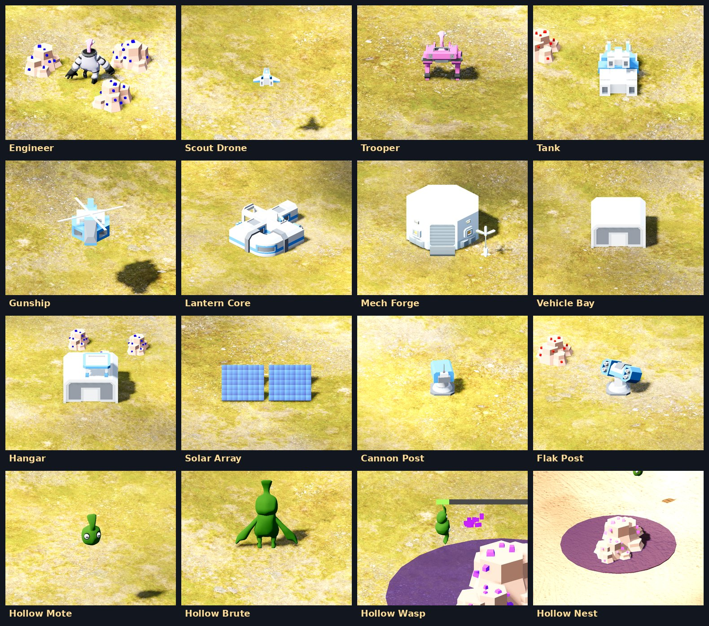
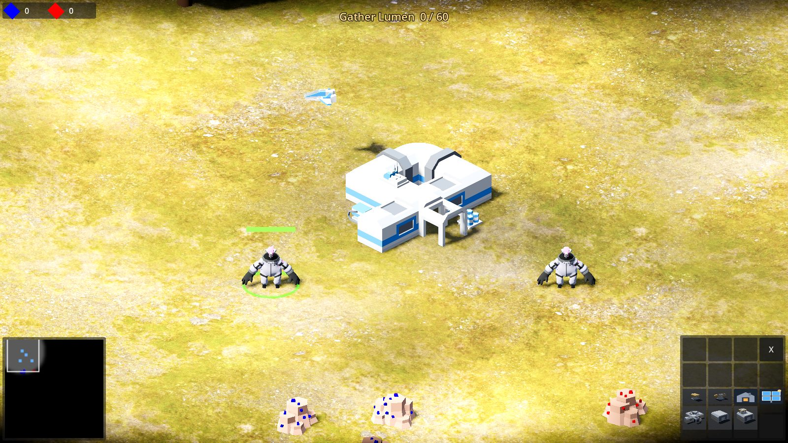
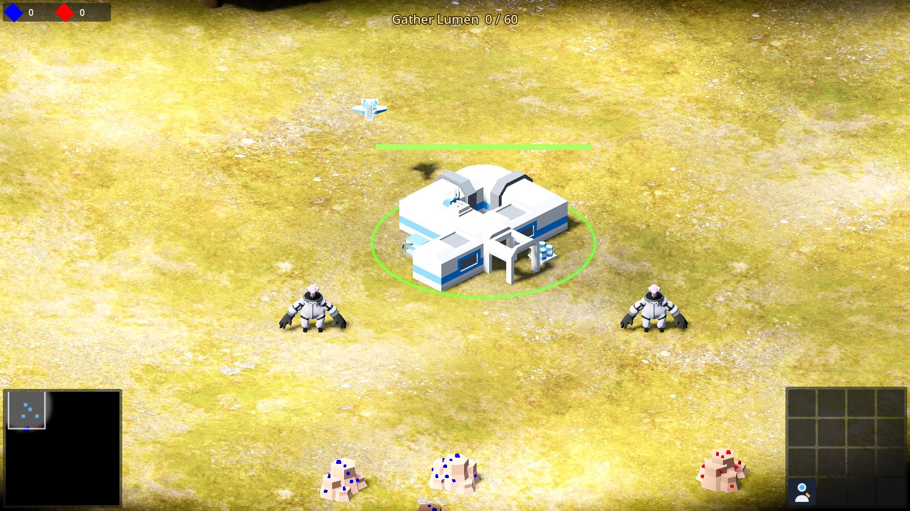

# How to play Lantern Reach

Every picture here is rendered by the game itself.

## The roster

### Your crew and machines (Pod Seven)

| Unit | What it does | HP | Attack | Cost (Lumen / Ember) | Built at |
|---|---|---|---|---|---|
| **Engineer** | Mines crystal and builds every structure. Your economy. Does not fight. | 6 | none | 2 / 0 | Lantern Core |
| **Scout Drone** | Fast flyer with the longest sight in the game. Sees at full range at night. Unarmed. | 6 | none | 2 / 0 | Hangar |
| **Trooper** | Mech infantry. Cheap, quick to build, hits ground and air. Your first line against the Hollow. | 8 | 1 every 0.6 s, range 4 | 2 / 1 | Mech Forge |
| **Tank** | Heavy ground gun. Breaks nests and Warden structures fastest. Cannot hit flyers. | 12 | 2 every 0.75 s, range 5 | 3 / 2 | Vehicle Bay |
| **Gunship** | Armed flyer. Crosses any terrain, hits ground and air, but is fragile for its price. | 10 | 1 every 1.0 s, range 5 | 1 / 3 | Hangar |

### Your structures

| Structure | What it does | HP | Cost (Lumen / Ember) |
|---|---|---|---|
| **Lantern Core** | The pod itself. Trains Engineers and receives the crystal they carry. If your last Core falls and you have no units left, the world is lost. | 30 | 8 / 8 |
| **Mech Forge** | Builds Troopers. Build it first on any world with nests. | 16 | 4 / 2 |
| **Vehicle Bay** | Builds Tanks. | 16 | 6 / 0 |
| **Hangar** | Builds Gunships and Scout Drones. | 16 | 4 / 4 |
| **Solar Array** | Adds 1 Lumen every 8 seconds of daylight with no Engineer. Keeps you building when the fields are gone or the Engineers are pinned down. | 8 | 3 / 0 |
| **Cannon Post** | Turret, ground targets only. Range 8, outranges every Hollow creature. | 8 | 2 / 2 |
| **Flak Post** | Turret, air targets only. The answer to Motes and Wasps. | 8 | 2 / 2 |

### The Hollow

| Creature | What it does | HP | Attack |
|---|---|---|---|
| **Mote** | Small flyer, the bulk of every wave. Dies to anything that can shoot up. | 4 | 1 every 1.0 s, melee |
| **Brute** | Big ground walker. Soaks damage and hits hard. Cannot reach flyers. Appears from the second wave. | 14 | 2 every 1.5 s, melee |
| **Wasp** | Fast flyer that bites quickly. Appears from the third wave. | 6 | 1 every 0.8 s, melee |
| **Nest** | A crystal outcrop the swarm grew into. Spawns the waves. Destroy every nest and the waves stop. | 30 | none |

The Wardens, the rival human faction, use exactly your roster in their own colour.

## Controls

| Do | How |
|---|---|
| Select a unit | Left-click it. Drag a box to select several. Double-click to select all of that type on screen. |
| Move | Select, then right-click the ground. |
| Attack | Select, then right-click an enemy. Armed units also fire on their own at anything in sight. |
| Mine | Select Engineers, right-click a crystal node. They mine and haul to the nearest Lantern Core until the node is empty, then find another. |
| Build | Select an Engineer, click a structure button at the bottom right, place it with the mouse, left-click to confirm. `R` rotates the ghost. Right-click cancels. |
| Train | Select a Lantern Core, Mech Forge, Vehicle Bay or Hangar and click a unit button. Up to five queue. |
| Rally point | With a producing structure selected, right-click the ground: new units walk there. |
| Camera | `WASD` or the screen edge scrolls, mouse wheel zooms, `Q` and `E` rotate, middle-drag rotates freely. |
| Groups | `Ctrl + 1..9` saves the selection, `1..9` recalls it. |
| Menu | `Esc`. |

## Reading the screen

- **Top left:** your Lumen (blue) and Ember (red).
- **Top centre:** the objective, with the survive countdown, the Lumen tally or the nests left.
  Night, dawn and every Hollow wave flash here too.
- **Bottom left:** the minimap. Your units are blue, enemies red, the Hollow purple. The
  white box is the camera. Black is unexplored, grey is explored but not currently seen.
- **Bottom right:** the selected unit's actions. An Engineer shows the seven structures;
  a Core, Forge, Bay or Hangar shows what it trains.

## The two currencies

**Lumen** (blue crystal) is quick to mine and buys almost everything. **Ember** (red crystal)
is slow to mine and buys weapons and engines: Tanks, Gunships, turrets and the Hangar. An
Engineer carries two crystal per trip. Keep at least two Engineers on each colour and put
the Core close to the fields.

## Day and night

A day lasts eight minutes; the last two and a half are night. At night everything but Scout
Drones sees only 60% as far, Hollow waves are 60% bigger, and Solar Arrays stop. Build your
turrets before the first dusk.

## The Hollow's clock

The first wave comes about two and a half minutes in (sooner on harder worlds). Each wave is
bigger than the last and comes sooner than the last, down to one every 45 seconds. Waves come
from living nests only, so the long-term answer is always the same: Tanks and Troopers to the
nest, Flak Posts at home.

## An opening that works

1. Both Engineers to the nearest Lumen field. Train two more Engineers at once.
2. At 4 Lumen and 2 Ember, build a Mech Forge beside the Core and queue Troopers.
3. Send one Engineer to Ember. Build a Flak Post and a Cannon Post on the side the nests are.
4. A Solar Array once you have 3 spare Lumen; it pays for itself in a day.
5. Scout with the Drone to find the nests and the Wardens before the first night.
6. When you hold the first two waves, a Vehicle Bay, three Tanks and six Troopers burn out a
   nest. Take them one at a time, at dawn.

## Winning

Each campaign world sets one objective; the top of the screen shows it.

- **Destroy every enemy:** Warden structures and units, and Hollow nests and creatures.
- **Survive:** the timer runs out while you still have units.
- **Gather Lumen:** your mined total reaches the target. Spending does not reduce it.
- **Burn out every nest:** no Hollow nest left standing.

You lose when you have no units or structures left. Winning unlocks the next world; the
campaign page shows which worlds are relit and lets you reset progress.

## Skirmish

Pick a map (Lantern Plain, four spawns, or Wide Reach, eight), a world for its terrain, who
sits in each spawn (you, Wardens, or nobody) and how many Hollow nests to add. Nests take the
spawn opposite you, then any spawns nobody took.
